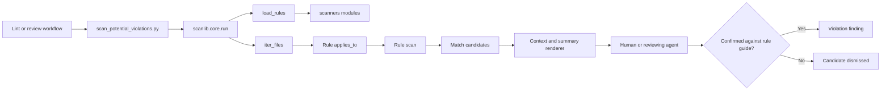
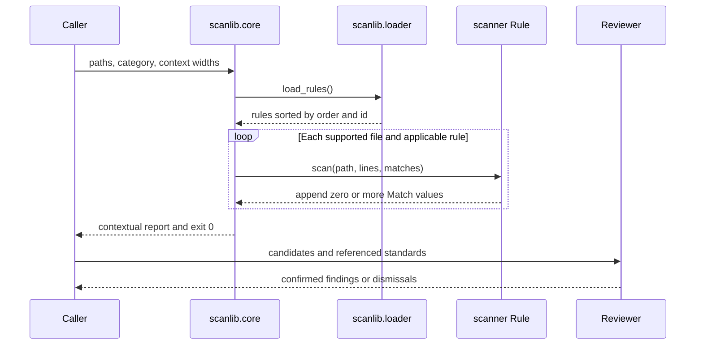

# Scanner architecture

The coding plugin ships an advisory scanner that finds mechanically recognizable review candidates before semantic lint or code review. It never decides that code violates a standard: candidate counts do not affect the status of a completed scan, and a human or reviewing agent must confirm each candidate against the referenced rule guide.

## Components

```text
plugins/coding/scripts/
├── scan_potential_violations.py  # stable command-line entry point
├── scanlib                      # discovery, file selection, execution, and rendering
│   ├── core.py                  # command-line contract and scan pipeline
│   ├── jsdoc.py                 # shared JSDoc token and prose extraction
│   ├── loader.py                # automatic RULE and RULES module discovery
│   ├── predicates.py            # reusable file applicability gates
│   ├── prefixes.py              # live standard rule-prefix discovery
│   └── rule.py                  # scanner extension interface
└── scanners                     # one independently loadable module per candidate rule
```

- **Command-line entry point** (`plugins/coding/scripts/scan_potential_violations.py`): imports the shared engine and returns its status.
- **Engine** (`plugins/coding/scripts/scanlib/core.py`): parses arguments, walks supported source files, applies rules, and renders contextual matches plus a summary.
- **Loader** (`plugins/coding/scripts/scanlib/loader.py`): imports every public module under `scanners` and isolates a broken module so one extension cannot disable the advisory pass.
- **Predicates** (`plugins/coding/scripts/scanlib/predicates.py`): centralizes language, test, index, and suffix selection.
- **Rule modules** (`plugins/coding/scripts/scanners/*.py`): recognize one mechanically detectable candidate shape and append `Match` values.
- **Test suite** (`plugins/coding/tests/test_scanner.py`): exercises rule behavior directly and uses golden fixtures only where the rendered command-line interface is the behavior under test.

## Pipeline



Candidate generation and violation decisions are deliberately separate. A scanner may trade precision for recall when its label and rule guide make the review requirement explicit. For example, the `TST-CORE-10` scanner flags static file reads in test files because they often precede assertions over checked-in prose; reading a generated output file can be valid and must be dismissed after review.

## Invocation lifecycle



## Extension interfaces

Every scanner module exports `RULE` or `RULES`. The loader discovers modules automatically, so adding a scanner requires no dispatcher edit.

```python
RULE = Rule(
    id="stable-category-name",
    label="Reviewer-facing candidate label",
    scan=scan,
    order=100,
    applies_to=candidate_files,
    rule_refs=("TST-CORE-10",),
)
```

The interfaces are:

| Interface | Contract |
|---|---|
| `Rule.id` | Unique stable command-line category |
| `Rule.label` | Heading that describes the candidate without prejudging it |
| `Rule.scan` | Callable receiving `path`, complete `lines`, and a mutable `matches` list |
| `Rule.order` | Deterministic report ordering; ties resolve by ID |
| `Rule.applies_to` | Path predicate evaluated before the file is read for that rule |
| `Rule.honor_no_tests` | Whether `--no-tests` suppresses the rule for spec files |
| `Rule.rule_refs` | Traceability to standards; metadata only, never an engine verdict |
| `Match` | Immutable `path`, one-based `lineno`, and source `line` rendered with context |

`scan` functions must not edit files, execute project code, or raise findings. They append candidates only. The engine catches file-read errors, isolates module import failures, and returns zero after a completed scan regardless of its match count. Invalid arguments and other operational failures remain errors.

## Command-line contract

```text
scan_potential_violations.py [paths ...]
  [--category all|<rule-id>]
  [--before <lines>]
  [--after <lines>]
  [--no-tests]
```

Paths may name files or directories. The engine scans supported JavaScript, TypeScript, Python, and Rust suffixes while excluding generated, dependency, cache, coverage, and version-control directories. Output is grouped by rule, includes source context, and ends with match and file counts.

## Adding a scanner

1. Add one kebab-equivalent Python module under `plugins/coding/scripts/scanners` that exports a `Rule`.
2. Reuse or add a narrow predicate in `plugins/coding/scripts/scanlib/predicates.py`.
3. Test candidates as structured `Match` values. Add a golden fixture only when changing the rendered command-line interface itself.
4. Reference the owning standard in `rule_refs` and list the rule as scanner-backed in its `scan.md`.
5. Run `uvx pytest plugins/coding/tests/test_scanner.py`, then the repository suite with `uvx pytest`.

Prefer a mechanical signal that is cheap to explain and verify. If recognizing the condition requires semantic interpretation, keep that decision in review rather than encoding a brittle verdict in the scanner.
